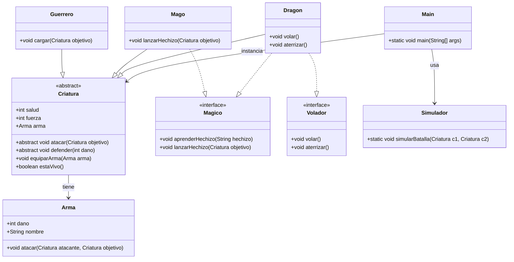

# ParcialPll

## Descripción del Proyecto

Este proyecto es una simulación de batallas entre criaturas fantásticas en Java, utilizando Maven para la gestión de dependencias y construcción. Las criaturas incluyen guerreros, magos y dragones, cada una con habilidades únicas y armas. El proyecto demuestra conceptos de Programación Orientada a Objetos (POO) como herencia, polimorfismo, clases abstractas e interfaces.

## Estructura del Proyecto

El proyecto está organizado en los siguientes paquetes bajo `com.example`:

- **modelo**: Contiene las clases principales del modelo de dominio.
  - `Criatura.java`: Clase abstracta base para todas las criaturas.
  - `Arma.java`: Clase que representa las armas utilizadas por las criaturas.
  - `Guerrero.java`: Subclase de Criatura que representa a un guerrero.
  - `Mago.java`: Subclase de Criatura que representa a un mago.
  - `Dragon.java`: Subclase de Criatura que representa a un dragón.

- **interfaces**: Contiene las interfaces que definen comportamientos específicos.
  - `Magico.java`: Interfaz para criaturas que pueden lanzar hechizos.
  - `Volador.java`: Interfaz para criaturas que pueden volar.

- **simulador**: Contiene la lógica de simulación de batallas.
  - `Simulador.java`: Clase que maneja la simulación de batallas entre criaturas.

- **Main.java**: Punto de entrada de la aplicación, donde se instancian las criaturas y se inicia la simulación.

## Requisitos Previos

- Java 17 o superior instalado.
- Maven 3.6 o superior instalado.
- Un entorno de desarrollo como IntelliJ IDEA, Eclipse o VS Code con soporte para Java y Maven.

## Instalación y Configuración

1. Clona o descarga el proyecto en tu máquina local.
2. Navega al directorio raíz del proyecto (donde se encuentra `pom.xml`).
3. Ejecuta `mvn clean install` para descargar dependencias y compilar el proyecto.

## Construcción del Proyecto

Para compilar el proyecto:

```bash
mvn clean compile
```

Esto generará los archivos `.class` en el directorio `target/classes`.

## Ejecución del Proyecto

Para ejecutar la aplicación:

```bash
mvn exec:java -Dexec.mainClass="com.example.Main"
```

Esto iniciará la simulación de batallas entre las criaturas definidas en `Main.java`.

## Pruebas

El proyecto no incluye pruebas unitarias en este momento, pero puedes agregarlas usando JUnit. Para ejecutar pruebas (si se agregan):

```bash
mvn test
```

## Diagrama de Clases

A continuación se muestra el diagrama de clases del proyecto:



## Contribución

Si deseas contribuir al proyecto:

1. Crea una rama nueva para tus cambios.
2. Realiza tus modificaciones.
3. Ejecuta las pruebas y asegura que el proyecto compile.
4. Envía un pull request con una descripción clara de los cambios.

## Licencia

Este proyecto es para fines educativos y no tiene una licencia específica asignada.